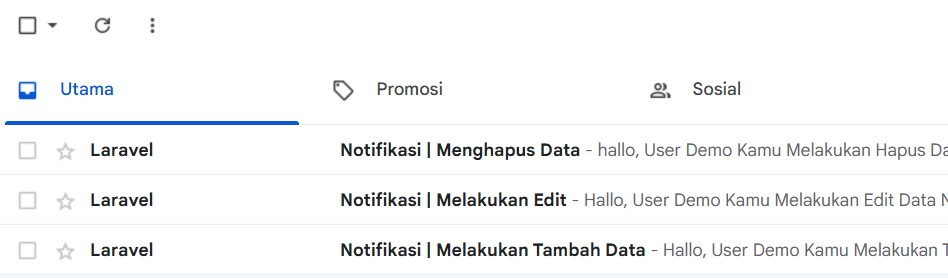
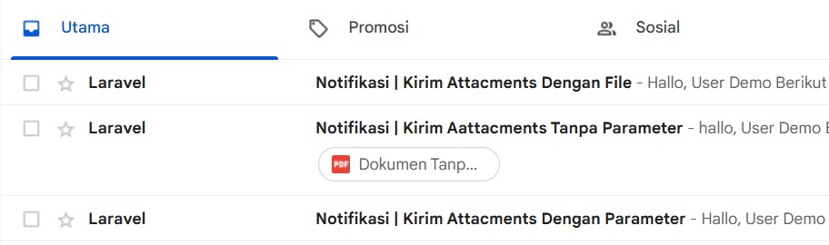

<p align="center"><a href="https://laravel.com" target="_blank"></a></p>

<p align="center">
<a href="https://github.com/laravel/framework/actions"></a>
<a href="https://packagist.org/packages/laravel/framework"></a>
<a href="https://packagist.org/packages/laravel/framework"></a>
<a href="https://packagist.org/packages/laravel/framework"></a>
</p>

# Example CRUD Notifikasi Email | Laravel + Bootstrap + javascript

Example CRUD Notifikasi Email Yang Dikirimkan Secara Otomatis ke Auth (Sedang Login) Setiap kali Melakukan Perubahan Data.

## Fitur

- Create Notifikasi Email
- Update Notifikasi Email
- Delete Notifikasi Email
- STMP (mailtraps)

## Teknologi

**Design:** Bootstrap

**Framework:** Laravel

**Bahasa:** PHP

**DataBase:** MySQL

## Package

- Laravel/ui

## Screenshot

**Notifikasi Email**

**Notifikasi Email Attacments**


## Instalasi

berikut ini merupakan panduan instalasi Example CRUD Notifikasi Email

Clone Repository

```bash
git@github.com:winnicodeofficial/LARAVEL-EXAMPLE-CRUD-NOTIFIKASI-CRUD.git
```

Composer Update

```bash
composer update
```

Create .env file

```bash
cp .env.example .env
```

Lakukan generate key

```bash
php artisan key:generate
```

Migrate Database

```bash
php artisan migrate
```

Terakhir,Hidupkan Web Server

```bash
php artisan artisan serve
```

Jalankan di browser dengan mengakses 127.0.0.1:8000

## Feedback

Berikan feedback

**EMAIL DEVELOPER :**
Apabila Membutuhkan Akses Sourcecode Dapat Menghubungi Email Berikut ini
mikozua45@gmail.com
